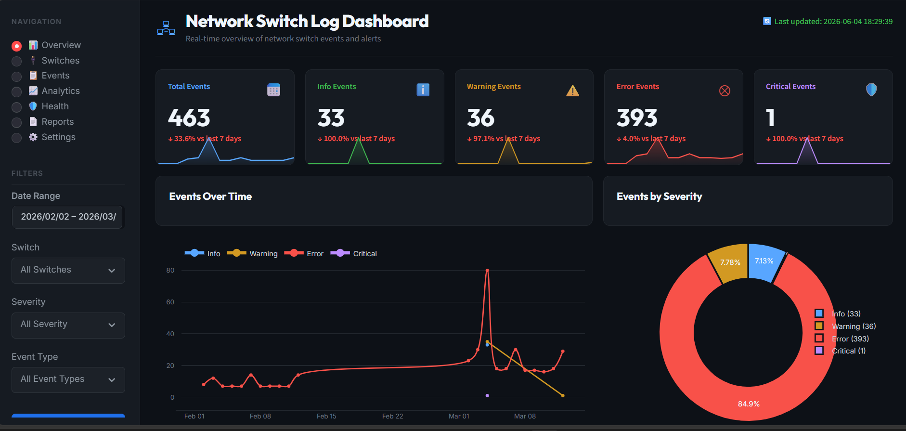
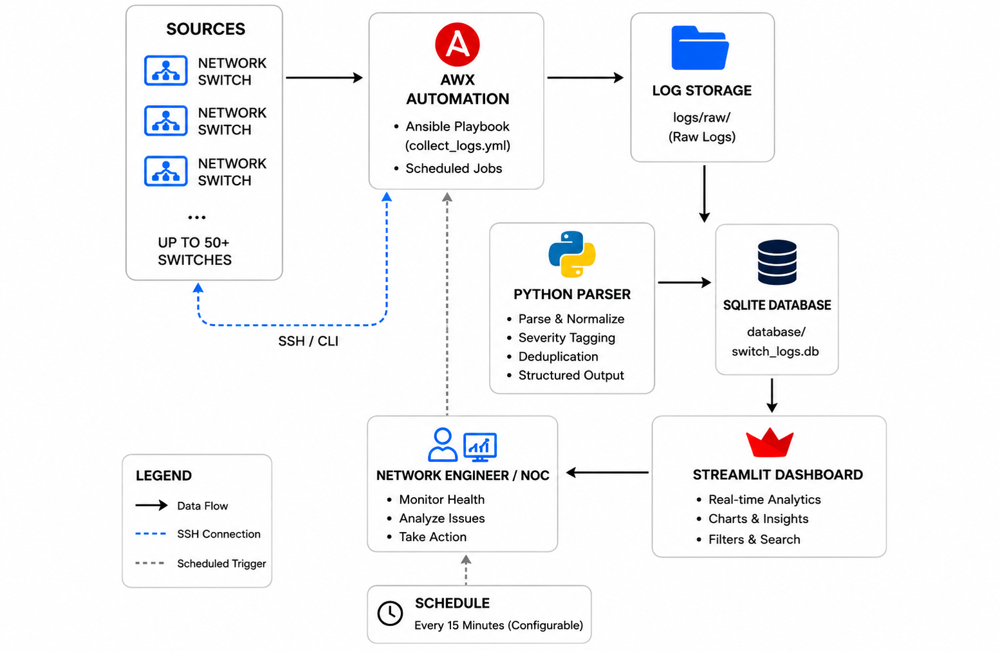

# 🔍 NetOps Automation

### Network Switch Log Monitoring & Analysis Platform

Automated log collection and real-time monitoring system for network switches. Collects syslogs from **50+ switches every 15 minutes** via AWX, parses them with Python, stores in SQLite, and visualizes through a Streamlit dashboard.

---

## 📊 Dashboard

<p align="center">
  
</p>

---

## ⚡ Features

- **Automated Collection** — AWX schedules log pulls every 15 minutes (configurable)
- **Smart Parsing** — Severity tagging (CRITICAL / ERROR / WARNING / INFO) with deduplication
- **Real-time Dashboard** — Live charts, switch filters, full-text search, top error summaries
- **Multi-vendor Support** — Cisco IOS, NX-OS, Arista EOS, and more
- **Lightweight Storage** — SQLite, no separate DB server needed
- **Scalable** — Handles 50+ switches in a single playbook run

---

## 📂 Project Structure

```
netops-automation/
├── ansible/
│   ├── collect_logs.yml       # Ansible playbook
│   ├── inventory/hosts.ini    # Switch inventory
│   └── group_vars/all.yml
├── scripts/
│   ├── parse.py               # Log parser
│   └── db_init.py             # DB schema setup
├── dashboard/
│   └── dashboard.py           # Streamlit app
├── logs/raw/                  # Raw logs (git-ignored)
├── database/switch_logs.db    # SQLite DB (git-ignored)
├── diagrams/
│   └── architecture.png
├── screenshots/
│   └── overview.png
├── .env.example
├── requirements.txt
└── README.md
```

---

## 🏗️ Architecture

<p align="center">
  
</p>

---

## ⚙️ Setup

### Prerequisites

| Tool | Version |
|------|---------|
| Python | 3.9+ |
| AWX / Ansible Tower | 21.0+ |
| Git | 2.x+ |

### Install & Run

```bash
# 1. Clone
git clone https://github.com/jassim-usman/netops-automation.git
cd netops-automation

# 2. Install dependencies
pip install -r requirements.txt

# 3. Configure environment
cp .env.example .env

# 4. Initialize database
python scripts/db_init.py

# 5. Launch dashboard
streamlit run dashboard/dashboard.py --server.port 8501
```

Then configure your AWX Job Template to run `ansible/collect_logs.yml` on a 15-minute schedule.

---

## 🔒 Security Notes

- Raw logs and the SQLite database are excluded from Git via `.gitignore`
- SSH credentials live in AWX Credential vault — never in playbooks or `.env`
- Use `ansible-vault` to encrypt any secrets in `group_vars/`
- See `.env.example` for all required environment variables

---

## 📈 Use Cases

- Monitor switch health across a large network
- Detect and alert on CRITICAL/ERROR log spikes
- Analyze syslog trends over time
- Track login activity and interface flaps

---

## 📄 License

MIT License — © 2026 Jassim Usman, Network Security Engineer

---

## 🤝 Contributing

See [CONTRIBUTING.md](CONTRIBUTING.md) for branch naming, commit conventions, and PR guidelines.
